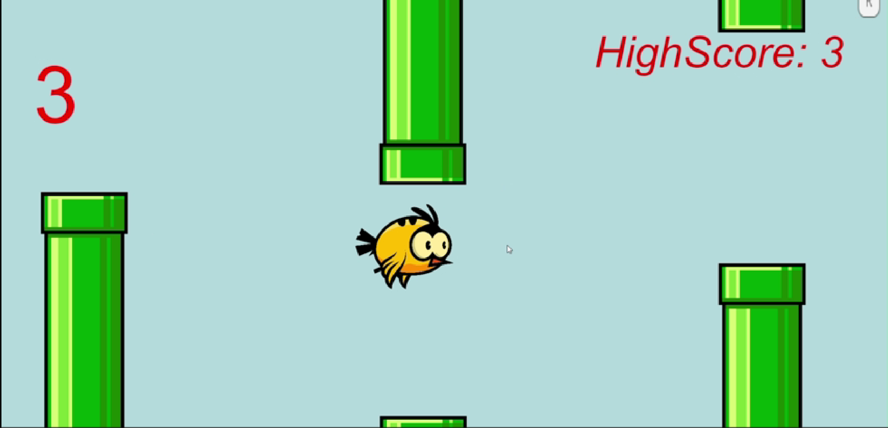
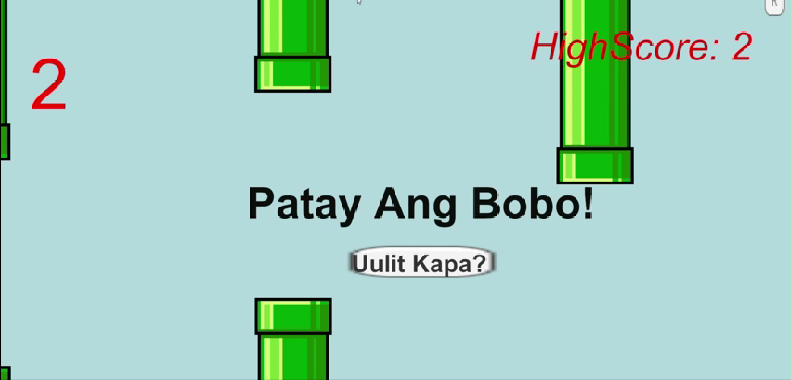

# 🐦 Flappy Bird Clone

## 📖 Description

This project is a recreation of the classic Flappy Bird game developed in Unity as a learning exercise. The goal of the project was to understand Unity fundamentals and improve my C# programming skills.

---

## 🛠️ Technologies Used

- Unity
- C#

---

## 🎯 Features

- Player movement
- Obstacle spawning
- Collision detection
- Score system
- Game Over screen
- UI implementation

  
---
## 📸 Screenshots

## 🎮 Game Play

## 💀 Game Over

---

## 🎥 Gameplay Video
https://youtu.be/UDYroYncdlY

---

## 📚 Learning Outcomes

Through this project, I learned:

- Unity game development basics
- C# scripting
- Physics and collision detection
- UI implementation
- Debugging and testing
